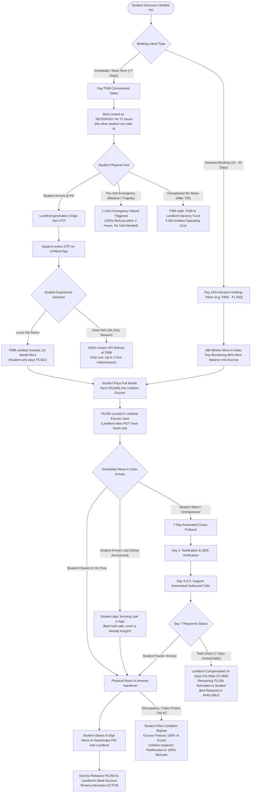

# 🛡️ UniNest Master Trust & Escrow Architecture Specification
### End-to-End Operational Lifecycle, Edge-Case Policies, & Dual-Stage OTP Handshakes

---

## 1. Executive Summary & Core Economic Philosophy

UniNest solves the classical "Lemon Market" and distrust dilemma between university students and local PG landlords:
* **The Student's Fear:** *"If I pay money upfront, will the landlord refuse to refund my deposit, misrepresent the room, or take my cash and ghost me?"*
* **The Landlord's Fear:** *"If I hold a bed for a student who changes their mind after 3 weeks, who will pay for my vacant bed during peak college admission season?"*

UniNest operates as an **algorithmic escrow mediator**. Funds are neither given immediately to the landlord nor kept indefinitely by the student. Every transaction follows clear mathematical milestones backed by physical handshakes.

---

## 2. Complete Lifecycle Flowchart



---

## 3. Detailed Edge-Case Matrix & Financial Allocation Rules

| Event / Scenario | Who Initiated? | Condition / Trigger | Financial Outcome for Student | Financial Outcome for Landlord | Action on Platform |
| :--- | :--- | :--- | :--- | :--- | :--- |
| **Visit Completed — Room Accepted** | Student | OTP entered at PG premises | ₹399 adjusted into rent (Pays ₹5,601) | Full month rent guaranteed upon move-in | Bed moves from `RESERVED` $\rightarrow$ `BOOKED` |
| **Visit Completed — Room Rejected (Dislike)** | Student | OTP entered; taps "Not for me" | **100% Refund (₹399)** back to student UPI instantly | ₹0 (No vacancy loss, bed only held 72h) | Bed status reverts to `AVAILABLE` immediately |
| **Emergency Prior to Visit** | Student | Hospitalization, family bereavement, admission cancel | **100% Refund (₹399)** via Emergency Waiver (2 per semester) | ₹0 (Landlord notified of verified student emergency) | Bed released back to marketplace |
| **No-Show without Notice (72h Token)** | Student | 72 hours elapse with zero visit/OTP | ₹399 forfeited | **Receives ₹200** vacancy disturbance credit | Bed automatically unlocked for other students |
| **Advance Reservation Cancelled (>30 Days)** | Student | Booked 45 days ahead; cancels with >30 days remaining | **85% Refund** of advance token | 15% platform buffer; negligible harm (30 days left) | Bed relisted as `AVAILABLE_FROM_DATE` |
| **Advance Reservation Cancelled (15–30 Days)** | Student | Cancels with 15–30 days remaining | **50% Refund** of advance token | **50% of token paid to Landlord** | Bed prioritized in student search |
| **Advance Reservation Cancelled (<7 Days)** | Student | Last-minute cancellation before semester | 0% Refund (Token forfeited) | **100% of Token paid to Landlord** | Emergency vacancy notification sent to college |
| **Delayed Move-In (Student Informed)** | Student | Student taps "Delayed by X days" (Train/Illness) | ₹0 deduction; room remains theirs for full paid month | Guaranteed full month payment on arrival | Landlord dashboard marked `TENANT_ARRIVING_DELAYED` |
| **Total Ghosting on Move-In (Unreachable for 7 Days)** | Student | Zero response to calls, SMS, WhatsApp for 7 full days | **Refunded ₹3,200** (Remaining balance) | **Paid ₹2,800** (7 days held + 7 days relisting buffer) | Bed contract terminated; bed relisted |
| **Property Misrepresentation on Move-In** | Landlord | Room has no AC, broken washroom, or wrong sharing | **100% Full Refund (₹6,000 + ₹399)** + Relocation Assistance | ₹0 payout; Landlord flagged for de-verification | Property suspended until physical audit |

---

## 4. Dual-Stage OTP Handshake Protocol

```mermaid
sequenceDiagram
    autonumber
    actor S as Student (Rahul)
    participant App as UniNest Cloud Platform
    actor L as Landlord (Vikram)
    participant E as Escrow Vault

    Note over S,L: STAGE 1: VISIT PROOF HANDSHAKE (₹399 Token)
    S->>App: Pays ₹399 Token via Direct UPI
    App->>E: Locks ₹399 in Escrow (72h Timer Starts)
    App->>L: Notifies: "Rahul Reserved Bed 204-B. Visit Scheduled."
    S->>L: Arrives physically at PG reception
    L->>App: Clicks "Generate Visit OTP"
    App-->>L: Displays 4-Digit PIN: 8412
    L->>S: Verbally shares PIN: 8412
    S->>App: Enters PIN 8412
    App->>App: Verifies Handshake
    App->>S: Prompts: "Do you like the room?"
    alt Student accepts
        S->>App: Clicks "Proceed to Book"
        App->>App: Applies ₹399 credit to 1st Month Rent
    else Student rejects or family emergency
        S->>App: Clicks "Not for me / Cancel"
        App->>E: Dispatches ₹399 refund to student's UPI
        App->>L: Releases bed back to AVAILABLE
    end

    Note over S,L: STAGE 2: MOVE-IN KEYS & ESCROW RELEASE (₹6,000 Rent)
    S->>App: Pays ₹5,601 Balance into Escrow
    App->>E: Holds ₹6,000 Total in Escrow
    Note over S,L: Move-In Day Arrives
    S->>L: Arrives with luggage; inspects room & receives physical key
    S->>App: Opens "Move-In Verification"
    App-->>S: Generates 6-Digit Move-In Key: 792-410
    S->>L: Hands over Move-In Key 792-410
    L->>App: Inputs 792-410 in Landlord Portal
    App->>App: Validates Handshake
    App->>E: Releases ₹6,000 to Landlord Bank Account
    App->>S: Tenancy marked ACTIVE; digital lease issued
```

---

## 5. Technical Data Schema Extensions (Prisma ORM)

To support this complete specification, the database models incorporate:

```prisma
enum ReservationType {
  IMMEDIATE_VISIT    // Standard 72h holding token (₹399)
  ADVANCE_SESSION    // 15-45 days future semester reservation (15% token)
}

enum HandshakeStatus {
  PENDING
  VISIT_OTP_VERIFIED
  MOVEIN_OTP_VERIFIED
  DISPUTE_FROZEN
  AUTO_RELEASED_GRACE
  REFUNDED_EMERGENCY
}

model Booking {
  // Existing fields...
  reservationType   ReservationType   @default(IMMEDIATE_VISIT)
  visitOtp          String?           // 4-digit numeric code
  visitVerifiedAt   DateTime?
  moveInOtp         String?           // 6-digit handshake pin
  moveInVerifiedAt  DateTime?
  handshakeStatus   HandshakeStatus   @default(PENDING)
  
  // Timing & Buffer Tracking
  agreedMoveInDate  DateTime?
  delayedMoveInDate DateTime?
  graceWindowEndsAt DateTime?         // MoveInDate + 7 Days
  emergencyReason   String?
  vacancyCompAmount Int?              // in paise, paid to landlord on forfeit
}
```

---

## 6. Real-World Compliance & Legal Guardrails

1. **Indian Contract Act, 1872 & Fair Escrow Guidelines:**
   * Holding earnest money is legally enforceable only when cancellation windows and vacancy damages are explicitly defined prior to payment.
   * UniNest's tiered cancellation terms comply with standard consumer protection guidelines because neither party can arbitrarily confiscate 100% of the funds outside of a 7-day total ghosting event.

2. **Fair Use Anti-Abuse Filter:**
   * Each student profile has a maximum of **3 free rejected-visit refunds per academic semester**.
   * On the 4th consecutive visit rejection, the student is prompted for structured feedback, preventing competitor scouting or non-serious market disruption.
